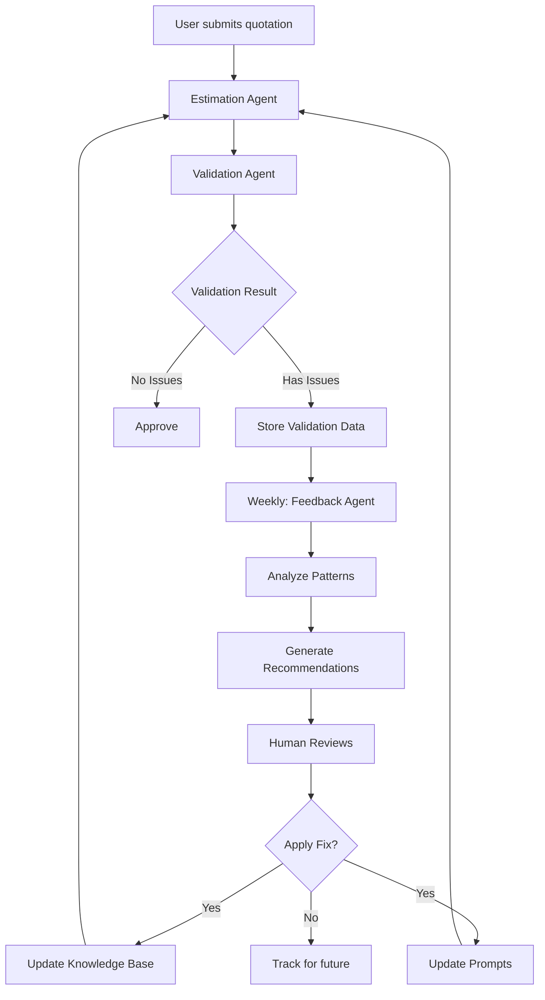

# Feedback Agent

## Purpose
Analyzes validation patterns from multiple estimations to identify knowledge gaps and suggest improvements to the estimation agent's prompts and knowledge base.

This agent implements a **continuous improvement loop**: validation issues → pattern analysis → knowledge base updates → better estimations.

## Components

- **`feedback.service.ts`**: Service orchestrator for feedback analysis
- **`feedback.prompt.md`**: AI agent instructions for pattern analysis and recommendation generation
- **Knowledge Base**: Shared with other agents (located in `../../knowledge/`)

## Process Flow

1. **Fetch validation data** from last N days (default: 30)
2. **Aggregate issues** by category, severity, frequency
3. **Identify patterns** (e.g., "vCPU costs exceed threshold in 67% of VMware projects")
4. **Invoke AI analysis** to determine root causes
5. **Generate recommendations** with specific fixes (file, location, content)
6. **Return actionable report** for human review

## Output Structure

```typescript
{
  analysis_period: "2026-05-01 to 2026-05-15";
  health_score: number; // 0-100
  summary: {
    critical_issues: number;
    high_priority_issues: number;
    medium_priority_issues: number;
    low_priority_issues: number;
  };
  recommendations: [
    {
      priority: "CRITICAL" | "HIGH" | "MEDIUM" | "LOW";
      category: "KNOWLEDGE_GAP" | "PROMPT_CLARITY" | "THRESHOLD_CALIBRATION" | "EDGE_CASE";
      issue_pattern: "Description of what's going wrong";
      root_cause: "Why estimation agent makes this mistake";
      affected_estimations_pct: 67; // Percentage
      specific_fix: {
        file: "knowledge/costs/vmware-costs.md";
        action: "ADD" | "UPDATE" | "REMOVE";
        location: "Section: VMware vSphere Pricing";
        content: "Exact text to add/modify";
      };
      alternative_fix?: {
        file: "agents/estimation/estimation.prompt.md";
        action: "UPDATE";
        location: "Step 3: Calculate Infrastructure Costs";
        content: "Exact instruction to add";
      };
      validation_test: "How to verify fix worked";
    }
  ];
  trends: {
    improving: ["Category showing improvement"];
    worsening: ["Category getting worse"];
    stable: ["Category unchanged"];
  };
  next_review_date: "2026-06-01";
}
```

## Recommendation Priority Framework

### CRITICAL (Fix immediately)
- HIGH severity issues appearing in >20% of estimations
- Issues causing REJECT decisions
- Mathematical errors (wrong formulas, incorrect sums)

### HIGH (Fix this sprint)
- MEDIUM severity issues appearing in >30% of estimations
- Governance violations
- Systematic completeness gaps

### MEDIUM (Address in backlog)
- LOW severity issues appearing frequently
- Threshold calibration needs
- Edge case documentation

### LOW (Monitor)
- Isolated issues (<5% of estimations)
- Subjective recommendations
- Minor optimization suggestions

## Usage

### Via API Endpoint

```bash
# Generate feedback analysis for last 30 days
curl -X POST http://localhost:3001/api/feedback/analyze \
  -H "Authorization: Bearer <SERVICE_TOKEN>" \
  -H "Content-Type: application/json" \
  -d '{"days_back": 30}'
```

### Programmatic Usage

```typescript
import { FeedbackAgentService } from './agents/feedback/feedback.service';

// Inject service
constructor(private readonly feedbackAgent: FeedbackAgentService) {}

// Run analysis
const analysis = await this.feedbackAgent.analyzeValidationPatterns(30);

// Process recommendations
for (const rec of analysis.recommendations) {
  if (rec.priority === 'CRITICAL') {
    console.log(`🚨 CRITICAL: ${rec.issue_pattern}`);
    console.log(`   Fix: ${rec.specific_fix.file} - ${rec.specific_fix.action}`);
  }
}
```

### Scheduled Analysis

Recommended frequency: **Weekly** (every Monday morning)

Add to cron or scheduler:

```typescript
// Schedule feedback analysis every Monday at 9 AM
@Cron('0 9 * * 1')
async runWeeklyFeedbackAnalysis() {
  const analysis = await this.feedbackAgent.analyzeValidationPatterns(7);
  
  // Email to team or post to Slack
  await this.notificationService.sendFeedbackReport(analysis);
  
  // Save to file for version control
  const reportPath = `./reports/feedback-${new Date().toISOString().split('T')[0]}.json`;
  fs.writeFileSync(reportPath, JSON.stringify(analysis, null, 2));
}
```

## Example Recommendations

### Example 1: Knowledge Gap

```json
{
  "priority": "CRITICAL",
  "category": "KNOWLEDGE_GAP",
  "issue_pattern": "Cost per vCPU exceeds €150/month in 8 out of 12 VMware projects (67%)",
  "root_cause": "Knowledge base missing VMware NSX Advanced networking costs (€40/vCPU/month). Estimation agent calculates only vSphere compute, not networking.",
  "affected_estimations_pct": 67,
  "specific_fix": {
    "file": "knowledge/costs/vmware-costs.md",
    "action": "ADD",
    "location": "After 'VMware vSphere Pricing' section",
    "content": "## VMware NSX Networking\n\n- NSX Standard: €25/vCPU/month\n- NSX Advanced: €40/vCPU/month\n- NSX Enterprise Plus: €60/vCPU/month\n\nInclude NSX costs for projects with `networkComplexity: HIGH`."
  },
  "validation_test": "Re-run estimation for PROJ001 and verify vCPU cost now within €50-150 range"
}
```

### Example 2: Prompt Clarity

```json
{
  "priority": "HIGH",
  "category": "PROMPT_CLARITY",
  "issue_pattern": "QA budget flagged as LOW (<10%) in 15 estimations despite qa_required=YES",
  "root_cause": "Estimation prompt mentions QA but doesn't emphasize 10% minimum governance requirement",
  "affected_estimations_pct": 33,
  "specific_fix": {
    "file": "agents/estimation/estimation.prompt.md",
    "action": "UPDATE",
    "location": "Step 4: Add Professional Services",
    "content": "⚠️ **GOVERNANCE REQUIREMENT**: QA/Testing budget MUST be ≥10% of total project cost unless explicitly excluded (qa='NO'). Include:\n- Test infrastructure setup\n- QA resource hours\n- Test automation tools"
  },
  "validation_test": "Run 5 new estimations with qa_required=YES and verify QA ≥10% in all"
}
```

### Example 3: Threshold Calibration

```json
{
  "priority": "MEDIUM",
  "category": "THRESHOLD_CALIBRATION",
  "issue_pattern": "PostgreSQL costs per TB flagged in 45% of database projects",
  "root_cause": "Knowledge base shows €60-100/TB/month but validation threshold is €20-80/TB/month. Real-world PostgreSQL RDS costs are €85/TB/month (within knowledge range but outside validation).",
  "affected_estimations_pct": 45,
  "specific_fix": {
    "file": "agents/validation/validation.prompt.md",
    "action": "UPDATE",
    "location": "Threshold Compliance section",
    "content": "- **Cost per TB storage**: Should be between €20-100/month (OPEX)\n  - Block storage: €20-40/TB\n  - Managed databases (RDS): €80-100/TB\n  - Object storage (S3): €5-15/TB"
  },
  "validation_test": "Re-validate PROJ005 (PostgreSQL) and confirm no threshold violation"
}
```

## Integration with Estimation Workflow



## Performance

- **Average latency**: 20-30 seconds (analyzing 30 days of data)
- **Token usage**: ~80k input, ~6k output
- **Cost per analysis**: ~$0.35 (with prompt caching)
- **Recommended frequency**: Weekly

## Metrics to Track

### Health Score Calculation

```
Health Score = 100 - (
  (critical_issues * 20) +
  (high_priority_issues * 10) +
  (medium_priority_issues * 5) +
  (low_priority_issues * 2)
)
```

- **90-100**: Excellent - Minor tuning needed
- **70-89**: Good - Address high-priority items
- **50-69**: Fair - Systematic improvements required
- **0-49**: Poor - Critical gaps, immediate action needed

### Success Metrics Over Time

Track these weekly:

1. **Validation APPROVE rate** (target: >70%)
2. **Average issues per estimation** (target: <2)
3. **HIGH severity issue rate** (target: <10%)
4. **Health score trend** (target: improving)

## Continuous Improvement Loop

### Week 1: Generate Baseline
```bash
npm run feedback:analyze -- --days=30
# Save: reports/feedback-2026-05-15.json
```

### Week 2: Apply Top 3 Recommendations
- Update knowledge base files
- Modify estimation prompt
- Test with sample quotations

### Week 3: Measure Impact
```bash
npm run feedback:analyze -- --days=7
# Compare to baseline: are issues decreasing?
```

### Week 4: Iterate
- Apply next batch of recommendations
- Document what worked / didn't work
- Adjust recommendation priority if needed

## Development

### Testing locally

```bash
# Start AI service
npm run start:dev

# Generate feedback analysis (via API)
curl -X POST http://localhost:3001/api/feedback/analyze \
  -H "Authorization: Bearer <SERVICE_TOKEN>" \
  -d '{"days_back": 7}'

# Or run manual script
node scripts/analyze-validation-patterns.js
```

### Adding New Analysis Patterns

1. Update `feedback.prompt.md` with new pattern detection rules
2. Add corresponding aggregation logic in `feedback.service.ts`
3. Test with historical validation data
4. Document pattern in this README

## Best Practices

### DO:
✅ Run analysis weekly to catch trends early  
✅ Prioritize CRITICAL and HIGH issues first  
✅ Test fixes with sample quotations before deploying  
✅ Track metrics to measure improvement  
✅ Version control recommendation reports  

### DON'T:
❌ Apply all recommendations blindly (some may conflict)  
❌ Change thresholds too frequently (creates instability)  
❌ Ignore LOW priority items indefinitely (they accumulate)  
❌ Skip validation tests after applying fixes  
❌ Modify knowledge base without documenting changes  

## Future Enhancements

1. **Auto-apply safe fixes**: Automatically update thresholds/prices for low-risk changes
2. **A/B testing**: Compare old vs. new knowledge base on same quotations
3. **Trend visualization**: Dashboard showing health score over time
4. **Alert system**: Notify team when health score drops below threshold
5. **Knowledge versioning**: Track which knowledge base version was used for each estimation
